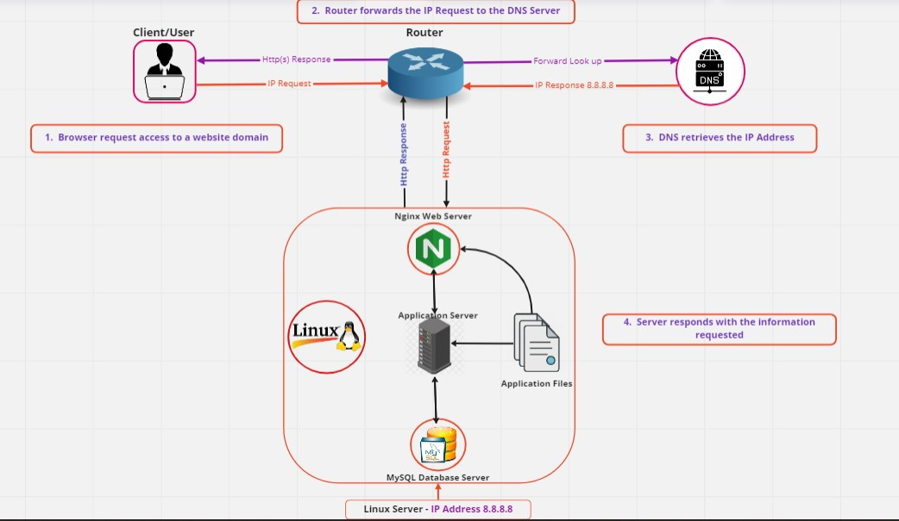

<a href= "https://miro.com/app/board/uXjVMZ32VH8=/?share_link_id=156770527244"> Visit Board </a>

<h3>Description</h3>

This is a simple web infrastructure that hosts a website that is reachable via ww.foobar.com. 
There are no firewalls or SSL certificates for protecting the server's network. 
Each component (database, application server) has to share the resources (CPU, RAM, and SSD) provided by the server.

<h3>Specifics About This Infrastructure</h3>

<ul list style type= disc>

<li> A server is a computer program or device that provides functionality for other programs or devices, called “clients”. 
Servers can provide various functionalities such as file storage and sharing, email services, web hosting, and more. </li>

<li> The domain name system (DNS) is a hierarchical and decentralized naming system for computers, services, or other resources connected to the Internet or a private network. 
It associates various information with domain names assigned to each of the participating entities. 
Most prominently, it translates more readily memorized domain names to the numerical IP addresses needed for locating and identifying computer services and devices 
with the underlying network protocols. </li>

<li> The www in www.foobar.com is a subdomain of foobar.com. It is a type of DNS record called a CNAME record that maps the subdomain to another domain name. </li>

<li> A web server is a computer program that serves requested HTML pages or files to web browsers over HTTP. The web server is responsible for serving web pages to clients over the internet. 
It processes incoming requests from clients and sends back the appropriate response, which may include HTML, CSS, JavaScript, images, and other resources. 
The most common web servers are Apache, Nginx, and Microsoft IIS. </li>

<li> An application server is a server program in a computer in a distributed network that provides the business logic for an application program. Application servers can be used to support web applications, middleware, and other distributed computing environments.</li>

<li> A database server is a computer program that provides database services to other computer programs or computers. It provides a mechanism for organizing, storing, and retrieving information in a structured manner. 
In the context of web hosting, a database is typically used to store and manage dynamic data, such as user accounts, product information, or blog posts. </li>

<li> When a user requests a website, their computer sends an HTTP request message to the web server. 
The web server then processes this request message and sends back an HTTP response message containing the requested content. </li>
</ul>

